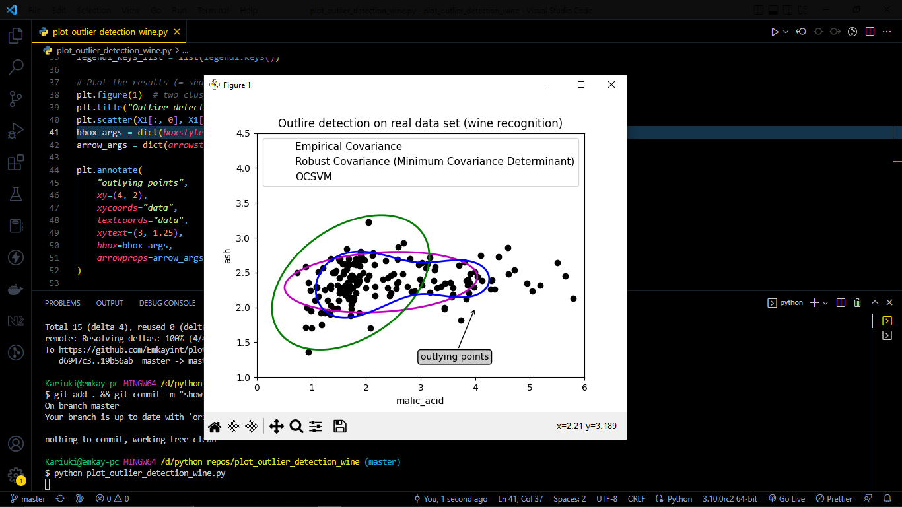

# Outlier Detection

- Illustration on the need for robust covariance estimation on a real data set. It is useful both for outlier detection and for a better understanding of the data structure.

## [Article](https://scikit-learn.org/stable/auto_examples/applications/plot_outlier_detection_wine.html#sphx-glr-auto-examples-applications-plot-outlier-detection-wine-py)

## Result

